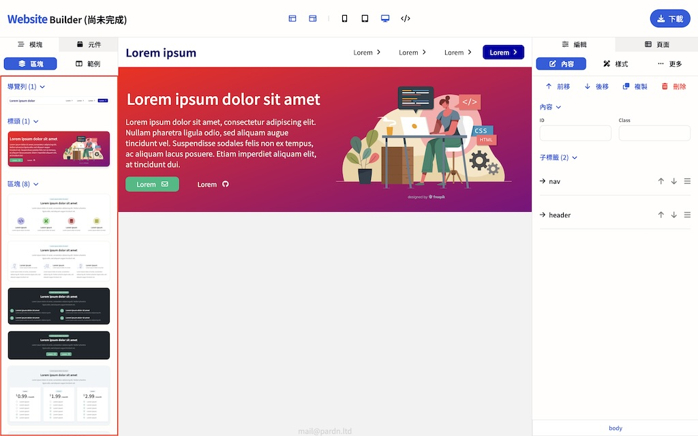
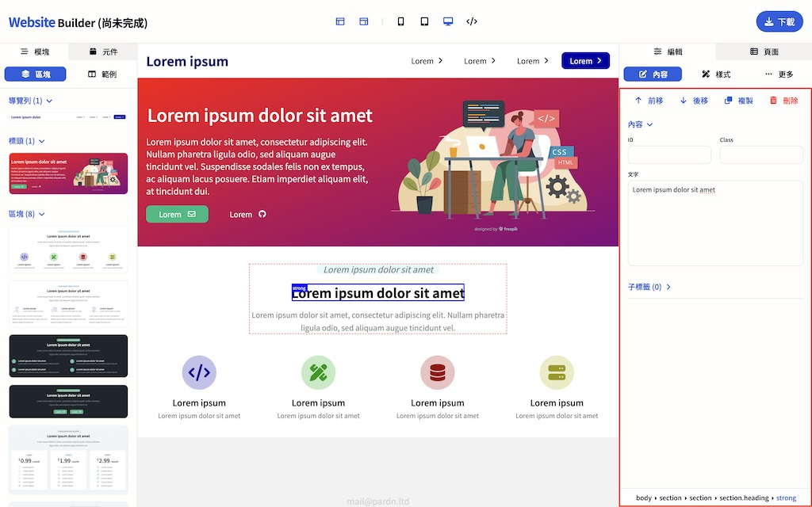

# Website Builder (In Progress)

*Currently only compatible with displays of 1024 and above*

## Features
- Various pre-made modules are available for use.
    
- Easy to edit content text and css style.
    
    
- Over 30 pre-made examples (5 / 32)

## Develop
- Built using HTML, CSS / Sass and JavaScript.
- Rendered using [PDExtension-js](https://github.com/pardnchiu/PDExtension-js).
- Use [Font Awesome 6](https://fontawesome.com/v6/search) icons and [Freepik](https://www.freepik.com/) images.
- Preview available [Here](https://pardnchiu.github.io/website-builder).

## Examples

|  |
| - |
|  | 
|  |
|  | 
|  | 

## Contributor

- [Pardn Chiu 邱敬幃](https://linkedin.com/in/pardnchiu)

## License

This source code project is licensed under the GPL-3.0 license.

***

©️ 2024 [Pardn Chiu 邱敬幃](https://linkedin.com/in/pardnchiu)

