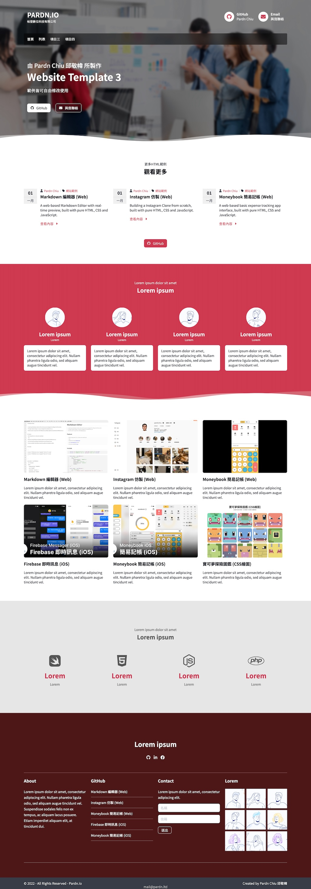
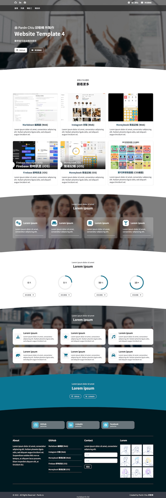

# Website Builder (未完成)
*當前僅適配1024以上的顯示*

## Over 30 Examples (4 / 32)

|  |  | 
| - | - | 
|   |  | 

## 功能特點

- 使用Html、Css / Sass和JavaScript編寫。
- 使用[Font Awesome 6](https://fontawesome.com/v6/search)圖標。
- 可以在[此處](https://pardnchiu.github.io/website-builder/)進行預覽。
- 可以在[GitHub](https://github.com/pardnchiu/website-builder)上找到源碼。

## 作者和貢獻者

- [Pardn Ltd 帕登國際有限公司](https://linkedin.com/company/pardnltd)
- [Pardn Chiu 邱敬幃](https://linkedin.com/in/pardnchiu)

## 授權

本源碼項目使用GPL-3.0 license授權。

版權所有 (c) 2023 [Pardn Ltd 帕登國際有限公司](https://www.linkedin.com/company/pardnltd)

